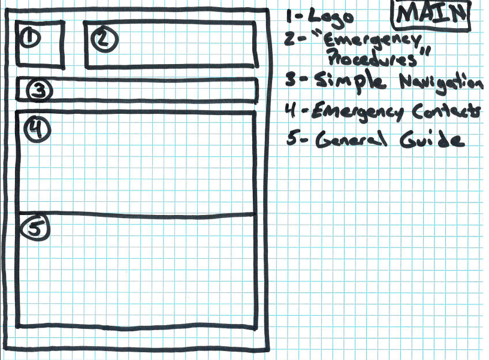
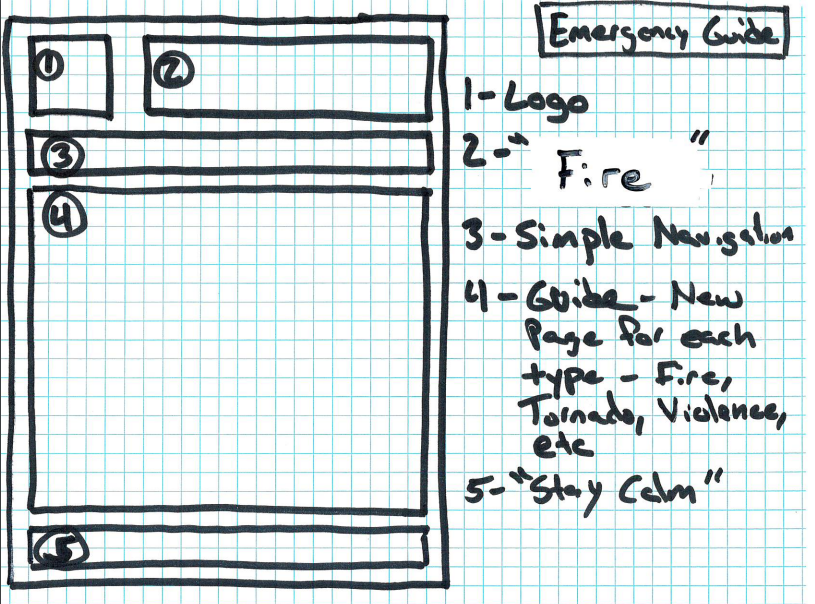
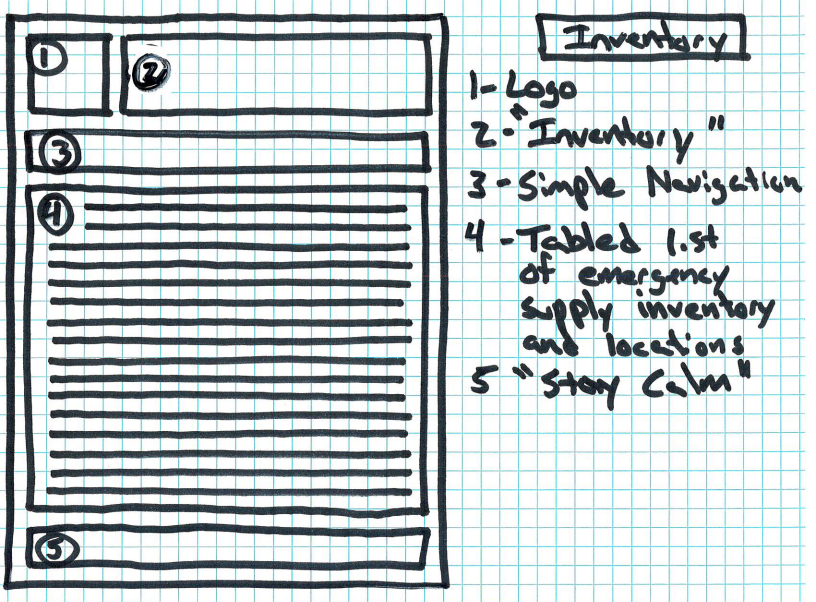

# Travis McAfee's INF 6420 Project

A site displaying important emergency response procedures and information.

# Wireframes

Here are wireframes for the major pages that will be a part of my site.

## Landing Page

Logo - An organizational logo image

Header - Emergegency Procedures - will display a large page title 

Navigation Menu - Will include links to several emergency scenarios and the emergency inventory list.

Main Content - on the landing page, this will be split between emergency contacts and general guidelines for emergencies

## Example Emergency Guide Page

Logo - An organizational logo image

Header - Emergegency Procedures - will display a large page title in this example, it might say, "Fire Emergency" 

Navigation Menu - Will include links to several emergency scenarios and the emergency inventory list.

Main Content - On an emergency procedure page, this will include step-by-step instructions on how to manage the emergency.

Footer - A big instructional message, such as "STAY CALM."

## Emergency Supplies inventory Page

Logo - An organizational logo image

Header - Emergegency Supplies inventory - will display a large page title.

Navigation Menu - Will include links to several emergency scenarios.

Main Content - This will be a tabled list displaying all emergency supplies in the building and where they can be located.

Footer - A big instructional message, such as "STAY CALM."